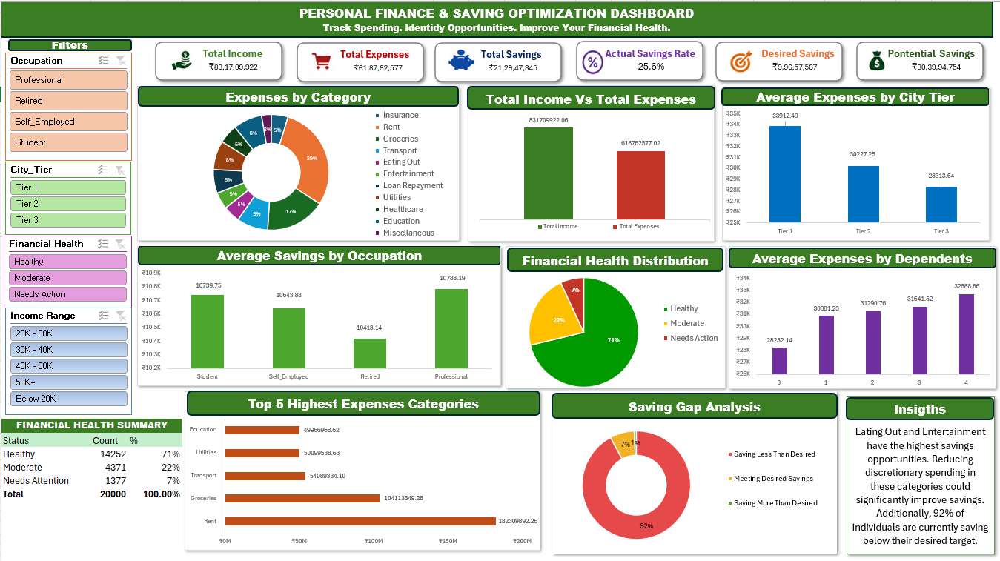

# Personal Finance & Savings Optimization Dashboard

## 📊 Project Overview

An Excel-based data analytics project designed to analyze personal
income, expenses, savings behavior, and savings opportunities.

## 🎯 Objectives

- Analyze income and expenses
- Identify major spending categories
- Compare savings across occupations
- Analyze expenses by city tier
- Study the impact of dependents on expenses
- Analyze financial health
- Identify potential savings opportunities
- Compare actual savings with desired savings

## 🛠️ Tools Used

- Microsoft Excel
- PivotTables
- PivotCharts
- Slicers
- Excel Dashboard
- Data Cleaning
- Data Analysis

## 📈 Dashboard

## 🔍 Key Analysis

### Income & Expenses
Analyzed income, total expenses, and actual savings across different
income ranges.

### Expense Analysis
Identified the major categories contributing to overall spending.

### Savings Analysis
Compared actual savings with desired savings and identified savings gaps.

### Financial Health
Segmented individuals into:
- Healthy
- Moderate
- Needs Action

### Savings Opportunity
Analyzed expense categories where reducing spending could create
additional savings.

## 💡 Key Insights

- Savings behavior varies across occupations.
- Expenses differ across city tiers.
- Average expenses increase as the number of dependents increases.
- A significant proportion of individuals save below their desired target.
- Certain discretionary expense categories provide greater savings opportunities.

## 📁 Files

| File | Description |
|---|---|
| `Dashboard.png` | Final dashboard preview |
|  `PERSONAL FINANCE & SAVING OPTIMIZATION DASHBOARD.xlsx`  | Complete Excel project |
| `README.md` | Project documentation |

# Personal Finance & Savings Optimization Dashboard

**Created by:** Sri Durgaa S K 
**Project Type:** Individual Data Analytics Project  
**Tool:** Microsoft Excel
